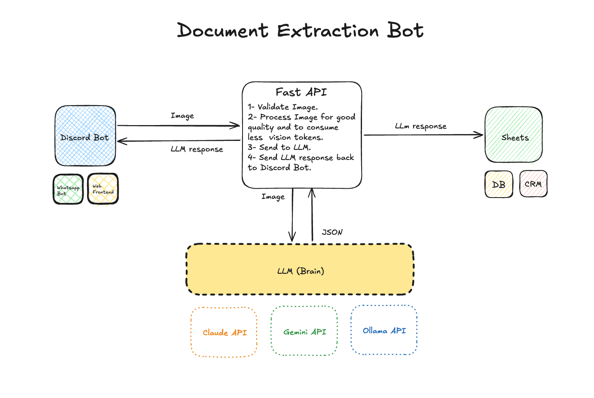

# Markdown# Discord Document Extraction System


A high-performance, resilient automation system that extracts structured data from document images uploaded via Discord or sent through an API. The system utilizes Large Language Models (LLMs) like Gemini 2.5 Flash to provide human-level document reasoning with automated persistence to Google Sheets.

---

## 🚀 Key Features

- **Multi-Channel Ingestion**: Discord Bot (human-centric) + REST API (batch-automation)
- **Dynamic Schema Support (BYOS)**: API users can provide a custom JSON schema per request for precision mapping
- **Hierarchical Extraction**: Intelligent grouping of data into logical sections (Headers, Line Items, Summary)
- **Cost Efficiency**: Automated image pre-processing (Grayscale/Resize) reduces token burn by ~60%
- **Self-Healing AI**: Automated LLM-based JSON repair loops to handle malformed outputs
- **Enterprise Observability**: Per-request token analytics and structured logging

---

## 🏗 System Architecture (P1)

The system follows **Hexagonal (Ports & Adapters) Architecture**. The core domain logic is decoupled from external delivery mechanisms, allowing for high testability and modular swaps of LLM providers.

### Core Pillars

| Pillar               | Implementation                                                                          |
| :------------------- | :-------------------------------------------------------------------------------------- |
| **P2 Security**      | Non-root Docker execution; Zero-persistence of PII (Image bytes stripped after hashing) |
| **P3 Concurrency**   | AsyncIO-driven bot and native `aio` LLM client; Semaphore-controlled task execution     |
| **P4 Performance**   | Lanczos Resampling & Grayscale optimization reduces vision token cost by >50%           |
| **P6 Resilience**    | Self-healing repair logic for JSON; Jittered exponential backoff for rate limits        |
| **P7 Observability** | Structured JSON logging (structlog); Per-request token burn-rate analytics              |

## Modularity

- **Swappable Entry Points**: The Discord Bot and Batch API are treated as interchangeable adapters. You can trigger the exact same extraction logic via a chat message or an automated script without duplicating code.

- **Provider Agility**: The LLM engine is abstracted. Switching from Gemini to OpenAI or a local Ollama instance only requires a new infrastructure adapter, keeping the domain logic and persistence layers intact.

- **Dynamic Schema Ingestion**: The "Bring Your Own Schema" (BYOS) feature allows users to define data structures via the API at runtime. The system internally constructs the required prompts, removing the need for a developer to manually update code for every new document type.



---

## 🛠 Tech Stack

- **Frameworks**: FastAPI, Discord.py (>= 2.3)
- **AI Engines**: Google Gemini
- **Image Ops**: Pillow (Optimal 1536px constraints)
- **Persistence**: Google Sheets API v4
- **Runtime**: Docker / Uvicorn

---

## 🤖 Usage Guide

### Method 1: Discord Bot (Human-Centric)

Upload any document image to the configured channel.

- **Auto-Mode**: Drop the image; the system classifies and extracts automatically
- **Manual Hint**: Use `!extract <type>` for specialized, cheaper, and faster prompts

#### Supported Type Hints

```text
!extract receipt         ← Optimized for financial logic
!extract invoice         ← Groups vendors and summary totals
!extract passport        ← Preserves color for identity photos
!extract id_card         ← High-fidelity extraction for small text
!extract bill_of_lading  ← Specialized logistics data extraction
!extract legacy          ← High-power prompt for degraded/handwritten docs
```

### Method 2: Batch API with Dynamic Schema (Automation)

The API supports **"Bring Your Own Schema"**. You define exactly how you want the JSON output to look.

#### Endpoint

```
POST /api/v1/extract/batch
```

#### Example cURL (Bill of Lading)

```bash
curl -X POST "http://localhost:8000/api/v1/extract/batch" \
     -H "Content-Type: application/json" \
     -d '{
    "extract": "Bill of Lading",
    "provider": "gemini",
    "model": "gemini-2.5-flash-lite",
    "documents": [
        {
            "id": "doc_1",
            "file_url": "https://example.com/sample_BOL.jpg"
        }
    ],
    "schema": {
        "type": "object",
        "properties": {
            "bol_number": "string",
            "shipper_info": { "name": "string", "full_address": "string" },
            "line_items": [{ "qty": "integer", "description": "string" }]
        }
    }
}'
```

---

## 📊 Understanding the Results

### Status Indicators (Discord)

| Status    | Meaning                |
| :-------- | :--------------------- |
| ✅ Green  | No human review needed |
| ⚠️ Yellow | Human review required  |

### 🚩 Flags

LLM detected ambiguity, blur, or anomalies in a specific value.

### Response Format (Discord)

```
📄 Document Extracted: Invoice
Status: ✅ Verified Extraction
Confidence: 93.5%

─── Vendor Info ───
Vendor Name      Invoice Number      Date
ACME Corp        INV-2026-001        2026-04-19

─── Payment ───
Subtotal         Tax                 Total
$1,200.00        $96.00              $1,296.00

📊 Table Data
1. Widget Assembly Line | 10 | 120.00

ID: 0fedb4ce • Engine: gemini • 🪙 Tokens: 1,234
```

---

## 📦 API Response Format

```json
{
  "results": [
    {
      "id": "doc_1",
      "status": "success",
      "data": {
        "bol_number": "...",
        "shipper_info": {}
      },
      "token_usage": {
        "prompt_tokens": 765,
        "completion_tokens": 736,
        "total_tokens": 1501
      }
    }
  ]
}
```

---

## ⚙️ Setup & Deployment

### Prerequisites

- Google Cloud Service Account (Base64 encoded JSON key)
- Google Gemini API Key
- Discord Bot Token (with Message Content Intent enabled)

---

### Environment Configuration (.env)

```env
DISCORD_BOT_TOKEN="your_token"
GOOGLE_GEMINI_API_KEY="your_key"
GOOGLE_SPREADSHEET_ID="your_sheet_id"
GOOGLE_SERVICE_ACCOUNT_B64="your_base64_json_key"
```

---

### Docker Build & Run

```bash
docker-compose up --build -d
```
